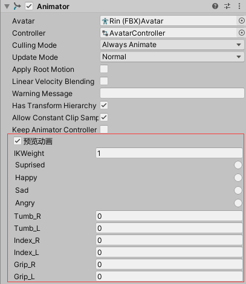

# SimpleAnimatorPreviweTool

An Animator preview tool for Unity

Have you ever wanted to preview the **Animator** in **edit** mode?

Now you can do that.

Import this script to your Editor. Then enjoy it.

**Before active preview, You need to exit animation preview mode**

# 简单的动画状态机预览工具

这是一个简单的 Unity Animator 预览工具

你是否想过能在**Editor**模式下预览你通过**Animator**做的混合动画？

现在你可以做到啦！

只需要把该脚本导入到你的Unity工程中，就可以在动画状态机中预览动画了。

**在激活状态机预览前，你需要先关闭Animation的Preview**

